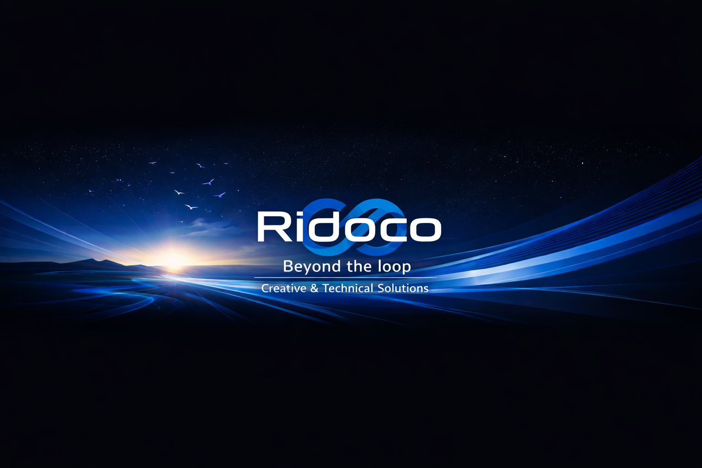

## Ridoco

Software studio in Cuijk, Netherlands. Systems, security, websites and brand work.

**Our repositories live at [github.com/Ridocompany](https://github.com/Ridocompany).**

This account is a personal profile and publishes nothing. If you are looking for
RidoGuard, EclipseCP or anything else we make, the organisation above is the only
place we publish from.

- [ridoco.com](https://ridoco.com) for services, packages and free tools
- [RidoGuard downloads](https://github.com/Ridocompany/ridoguard-releases/releases/latest)

KVK 95439609
